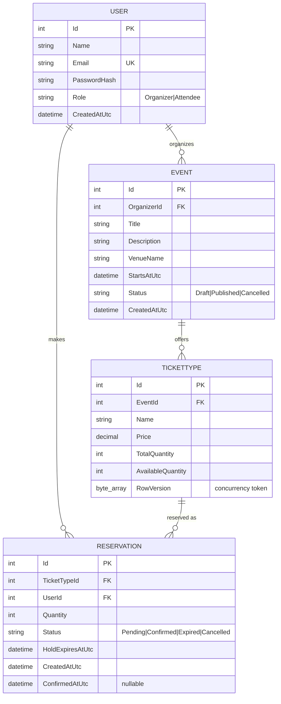
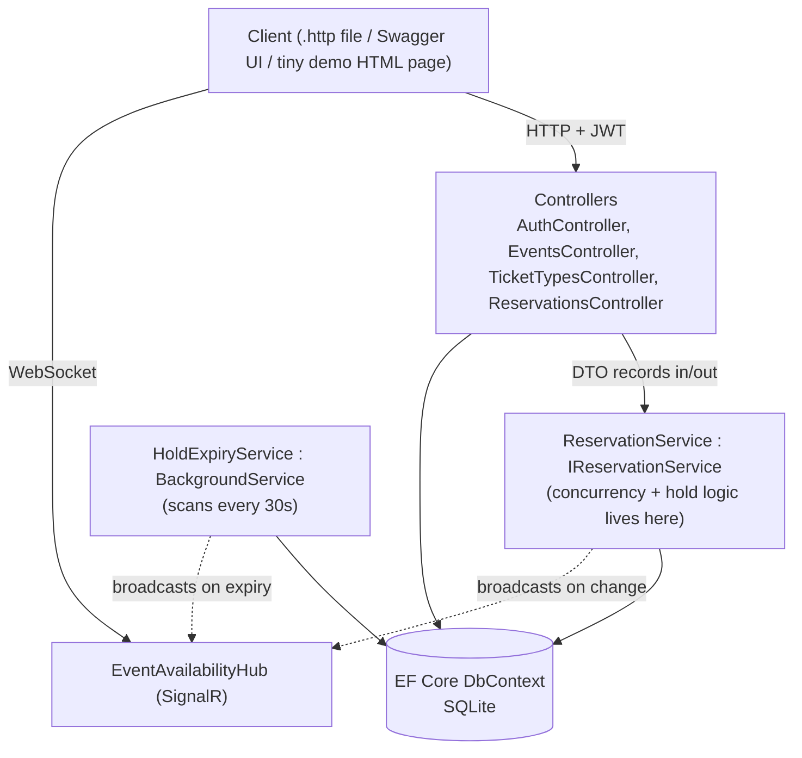

# SeatSure — Real-Time Event Ticketing & Reservation Platform
## Technical Blueprint 

**Tech stack:** ASP.NET Core (.NET 8 LTS), EF Core + MSSQL, JWT Bearer auth, SignalR, `BackgroundService` for hold expiry, xUnit for testing. Docker is stretch-only (§9).

---

## 1. Domain Model

### 1.1 Data Models

| Entity | Purpose |
|---|---|
| `User` | Attendee or Organizer. Auth identity. |
| `Event` | Owned by an Organizer. Has a venue name, start time, status. |
| `TicketType` | Belongs to an Event (e.g. "General", "VIP"). Holds price and inventory. |
| `Reservation` | A hold or confirmed purchase against a `TicketType`, made by a `User`. |

### 1.2 ER Diagram



### 1.3 Key constraints

- `User.Email` — unique index.
- `TicketType.AvailableQuantity` — never negative; enforced in application logic inside a transaction, not just a DB check constraint (the whole teaching point is *why* app-level enforcement + concurrency tokens are needed).
- `TicketType.RowVersion` — SQLite: implemented as an EF Core concurrency token (`[Timestamp]`-equivalent via `IsRowVersion()` on a `byte[]`, or a manually incremented `int Version` column if the SQLite provider quirks make native rowversion awkward — decide and pin this in Session 5, see ADR note in §8).
- `Reservation.Quantity` — must be ≥ 1, and ≤ the ticket type's available quantity at time of request.
- Foreign keys: `Event.OrganizerId → User.Id`, `TicketType.EventId → Event.Id` (cascade delete), `Reservation.TicketTypeId → TicketType.Id`, `Reservation.UserId → User.Id`.

---

## 2. Architecture



**Explicitly not in scope for Core:** generic repository/UoW, MediatR/CQRS, microservices, message queues, Redis. If a Stretch trainee wants to swap `BackgroundService` polling for a queue-based approach, that's a written comparison exercise, not required code (same pattern as the original ADR-004).

**One business rule, one service — the load-bearing lesson of Session 6 (was S5 in the old plan):** all reservation logic (create hold, confirm, cancel, expire) lives in `IReservationService`, injected into controllers. This is where the concurrency handling and the "why does this class exist" conversation happens.

---

## 3. API Contract (frozen — same discipline as before: one contract, all trainees code against it)

### 3.1 Auth

| Operation | Method + Path | Success | Failure |
|---|---|---|---|
| Register | `POST /api/auth/register` | `201` | `400` validation, `409` email taken |
| Login | `POST /api/auth/login` | `200` `{ token, expiresAtUtc }` | `401` |

### 3.2 Events

| Operation | Method + Path | Success | Failure |
|---|---|---|---|
| List published events | `GET /api/events?page=1&pageSize=10` | `200` paged envelope | `400` bad paging |
| Get event | `GET /api/events/{id}` | `200` | `404` |
| Create event (Organizer) | `POST /api/events` | `201` + `Location` | `400`, `401`, `403` |
| Publish event (Organizer, owner only) | `POST /api/events/{id}/publish` | `200` | `404`, `403` |

### 3.3 Ticket Types

| Operation | Method + Path | Success | Failure |
|---|---|---|---|
| List ticket types for event | `GET /api/events/{eventId}/ticket-types` | `200` | `404` event |
| Add ticket type (Organizer, owner only) | `POST /api/events/{eventId}/ticket-types` | `201` | `400`, `403`, `404` |

### 3.4 Reservations — the core of the project

| Operation | Method + Path | Success | Failure |
|---|---|---|---|
| Create hold | `POST /api/ticket-types/{id}/reservations` `{ quantity }` | `201` Pending, `holdExpiresAtUtc` = now+10min | `400` bad quantity, `404`, **`409` insufficient inventory / concurrency conflict** |
| Confirm reservation | `POST /api/reservations/{id}/confirm` | `200` Confirmed | `404`, `409` already expired/confirmed |
| Cancel reservation | `POST /api/reservations/{id}/cancel` | `200` Cancelled, inventory restored | `404`, `403` not owner |
| My reservations | `GET /api/users/me/reservations` | `200` | `401` |

**The `409` on create-hold is the whole point of the project.** Two concurrent requests for the last ticket: one wins (`201`), one loses (`409` with a clear Problem Details message), and inventory is never oversold. Every trainee must be able to demo this with two terminal windows / two Postman tabs firing at once.

### 3.5 Conventions (unchanged from before)

camelCase JSON, UTC ISO-8601 with `Utc` suffix, `int` ids, RFC 7807 Problem Details for all errors, offset pagination envelope:

```json
{ "items": [...], "page": 1, "pageSize": 10, "totalCount": 42 }
```

DTOs are `record`s; entities never cross the controller boundary — same rule, day one.

### 3.6 SignalR contract

Hub: `/hubs/events`

- Client joins group `event-{eventId}` on connect (via a `JoinEvent(eventId)` hub method).
- Server broadcasts `AvailabilityChanged(ticketTypeId, availableQuantity)` to the group whenever a hold is created, confirmed, cancelled, or expired.
- No auth required to *view* availability (public); reservation actions still go through the authenticated REST API.

---

## 4. Concurrency Design (the hard part — teach it explicitly)

1. Read `TicketType` with its `RowVersion`/`Version`.
2. Check `Quantity <= AvailableQuantity`.
3. Decrement `AvailableQuantity`, save. EF Core includes the original `RowVersion` in the `WHERE` clause automatically.
4. If another request modified the row first, EF Core throws `DbUpdateConcurrencyException` → service catches it → controller returns `409` with a Problem Details body explaining "someone booked first, please retry."
5. Wrap steps 1–3 in a single `DbContext` SaveChanges call inside a service method — no separate read-then-write across two round trips without the token, or the lesson is lost.

This single mechanism is the "explain this design decision" question every trainee should be able to answer in their explanation interview — same evidentiary role the old ADR-006/auth explanation played.

---

## 5. Background Service (Hold Expiry)

`HoldExpiryService : BackgroundService`:

- Runs a loop, `await Task.Delay(TimeSpan.FromSeconds(30), stoppingToken)` between scans.
- Each scan: query `Reservations` where `Status == Pending && HoldExpiresAtUtc < DateTime.UtcNow`.
- For each: set `Status = Expired`, restore `TicketType.AvailableQuantity += Quantity`, save, broadcast `AvailabilityChanged` via the SignalR hub.
- Must use a scoped `IServiceScopeFactory` to resolve a fresh `DbContext` per scan (the standard `BackgroundService` + scoped-service gotcha — worth teaching explicitly, it trips up almost everyone the first time).

---

## 6. Auth Design

- JWT Bearer, issued on login. Claims: `sub` (user id), `role` (`Organizer`/`Attendee`), `email`.
- `[Authorize(Roles = "Organizer")]` on event/ticket-type creation endpoints.
- Ownership check (not just role) on publish/edit: the organizer must own the event — this is a manual check in the service/controller, not something `[Authorize]` alone gives you. Same "authn vs authz vs ownership" lesson as the old plan's Session 7, just moved earlier since auth is now core, not stretch-only.
- Password hashing: `ASP.NET Core Identity`'s hasher or a lightweight `BCrypt.Net` package — pick one and pin it in Session 4, don't leave it open.

---

## 7. Testing Strategy (Session 8)

- **Unit tests** on `IReservationService`: the 409-on-oversell case, the successful hold case, the expiry restores-inventory case. This is where the concurrency logic gets proven, not just demoed.
- **Integration tests** (`WebApplicationFactory`): full create-event → add-ticket-type → reserve → confirm happy path; one negative test (reserve more than available → `409`).
- Green `dotnet build` + `dotnet test` is the Session 8 checkpoint, same bar as before.


